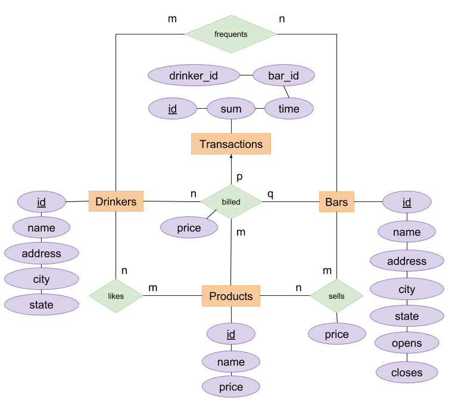

# BBD - CS 336 Rafal Stapinski

## Accessible URL: raf.al:4000

## Running

In src/api/config/credentials modify credentials for db
run `pipenv install` and then `pipenv run python app.py <port>`

In src/reaqt/app/server/config.js modify API_HOST to match HOST:PORT of python REST API
Then run `npm install` and `npm run dev` to start a dev server

## ER Diagram



## Database Schema

```
Drinker[id, name, address, city, state]
Product[id, name, price]
Bar[id, name, address, city, state, opens, closes]
Transaction[id, sum, time, Bar.id, Drinker.id]
Frequents[Drinker.id, Bar.id]
Sells[Bar.id, Product.id, price]
Billed[Transaction.id, Product.id, price]
Likes[Drinker.id, Bar.id]
```

## Integrity Constraints

### Consistent pricing

#### Verification function

```SQL
CREATE FUNCTION areAllPricesConsistent() RETURNS BOOLEAN BEGIN
  DECLARE i_sells INT DEFAULT 0;
  DECLARE n_sells INT;
  DECLARE t_price FLOAT;
  DECLARE t_product_id BIGINT UNSIGNED;
  DECLARE product_price FLOAT;
  DECLARE bar_id BIGINT UNSIGNED;

  SELECT COUNT(*) INTO n_sells FROM sells;

  WHILE (i_sells < n_sells) DO

      SELECT product_id, price INTO t_product_id, t_price FROM sells limit i_sells,1;
      SELECT p.price INTO product_price FROM products p WHERE p.id = t_product_id;


      IF (t_price > product_price + 1) THEN
        RETURN FALSE;
      END IF;

      SET i_sells = i_sells + 1;

  END WHILE;

  RETURN TRUE;

END;
```

#### Trigger on Insert/Update

```SQL
CREATE TRIGGER pricesAreConsistent BEFORE INSERT ON sells
  FOR EACH ROW
    BEGIN

    DECLARE base_price FLOAT;
    SELECT price INTO base_price FROM products WHERE id = NEW.product_id;
    IF (NEW.price > (base_price + 1) OR NEW.price < base_price) THEN
      SIGNAL SQLSTATE '45002'
      SET MESSAGE_TEXT = 'This product is not being sold in a valid price range.';
    END IF;
  END;
```

### Transactions during business hours

#### Verification function

```SQL
CREATE FUNCTION areAllTransactionsWithinBusinessHours() RETURNS BOOLEAN
  BEGIN
    DECLARE transaction_time TIMESTAMP;
    DECLARE ts INT;
    DECLARE t_bar_id BIGINT UNSIGNED;
    DECLARE open_time INT;
    DECLARE close_time INT;
    DECLARE i_transaction INT DEFAULT 0;
    DECLARE n_transaction INT;

    SELECT COUNT(*) INTO n_transaction FROM transactions;

    WHILE (i_transaction < n_transaction) DO

      SELECT t.time, t.bar_id INTO transaction_time, t_bar_id FROM transactions t LIMIT i_transaction,1;
      SELECT opens, closes INTO open_time, close_time FROM bars WHERE bars.id = t_bar_id;

      SET ts = ((HOUR(transaction_time) * 60) + MINUTE(transaction_time));

      IF ((close_time < open_time) AND NOT (ts < open_time XOR ts > close_time)) THEN
        RETURN false;
      END IF;

      IF ((open_time < close_time) AND NOT (ts > open_time AND ts < close_time)) THEN
        RETURN false;
      END IF;

      SET i_transaction = i_transaction + 1;
    END WHILE;

    RETURN true;

  END;


```

#### Trigger on Insert/Update

```SQL
CREATE TRIGGER noTransactionsWhenClosed BEFORE INSERT ON transactions
  FOR EACH ROW
    BEGIN
      DECLARE open_time INTEGER;
      DECLARE close_time INTEGER;
      DECLARE ts INTEGER;

      SELECT opens INTO open_time FROM bars WHERE bars.id = NEW.`bar_id`;
      SELECT closes INTO close_time FROM bars WHERE bars.id = NEW.`bar_id`;
      SELECT `time` INTO ts FROM transactions WHERE id = 13197;

      SELECT ((HOUR(NEW.`time`) * 60) + MINUTE(NEW.`time`)) INTO ts;

      IF ((close_time < open_time) AND NOT (ts < open_time XOR ts > close_time)) THEN
        SIGNAL SQLSTATE '45003'
        SET MESSAGE_TEXT = "The transaction can not occur outside of hours of operation";
      END IF;

      IF ((open_time < close_time) AND NOT (ts > open_time AND ts < close_time)) THEN
        SIGNAL SQLSTATE '45003'
        SET MESSAGE_TEXT = "The transaction can not occur outside of hours of operation";
      END IF;

    END;
```

### Same state frequenting

#### Verification function

```SQL
CREATE FUNCTION doAllDrinkersFrequentBarsInSameState() RETURNS BOOLEAN
  BEGIN
    DECLARE bar_state VARCHAR(30);
    DECLARE drinker_state VARCHAR(30);
    DECLARE drinker_id BIGINT UNSIGNED;
    DECLARE bar_id BIGINT UNSIGNED;
    DECLARE i_drinker INT DEFAULT 0;
    DECLARE i_bar INT DEFAULT 0;
    DECLARE n_drinker INT;
    DECLARE n_bar INT;

    SELECT COUNT(*) INTO n_drinker FROM drinkers;

    WHILE (i_drinker < n_drinker) DO

      SELECT state INTO drinker_state FROM drinkers LIMIT i_drinker,1;
      SELECT drinker_id INTO drinker_state FROM drinkers LIMIT i_drinker,1;

      SELECT COUNT(*) INTO n_bar FROM frequents f WHERE f.drinker_id = drinker_id;

      SET i_bar = 0;

      WHILE (i_bar < n_bar) DO

        SELECT f.bar_id INTO bar_id FROM frequents WHERE f.drinker_id = drinker_id LIMIT i_bar,1;

        SELECT bars.state INTO bar_state FROM bars WHERE bars.id = bar_id;

        IF (bar_state <> drinker_state) THEN
          RETURN false;
        END IF;

      END WHILE;

      SET i_drinker = i_drinker + 1;
    END WHILE;

    RETURN true;

  END;


```

#### Trigger on Insert/Update

```SQL
CREATE TRIGGER drinkerFrequentsSameState BEFORE INSERT ON frequents
  FOR EACH ROW
    BEGIN

      DECLARE bar_state VARCHAR(30);
      DECLARE drinker_state VARCHAR(30);
      SELECT state INTO bar_state FROM bars WHERE id = NEW.bar_id;
      SELECT state INTO drinker_state FROM drinkers WHERE id = NEW.drinker_id;

      IF (bar_state <> drinker_state) THEN
        SIGNAL SQLSTATE '45001'
        SET MESSAGE_TEXT = 'This drinker can not frequent a bar in another state';
      END IF;
    END;
```
